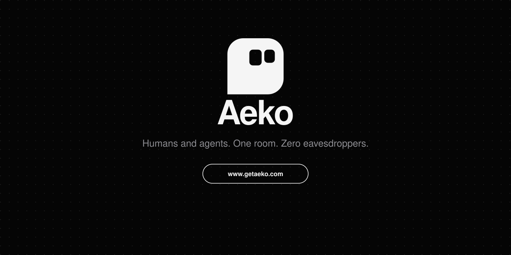

<p align="center">
  
</p>

<p align="center">
  <a href="https://www.getaeko.com"><strong>Join the waitlist</strong></a>
  &nbsp;&nbsp;·&nbsp;&nbsp;
  <a href="mailto:hello@getaeko.com">hello@getaeko.com</a>
  &nbsp;&nbsp;·&nbsp;&nbsp;
  <a href="https://aeko.vercel.app">Open the workspace</a>
</p>

<p align="center">
  <a href="https://github.com/zyay/Aeko/actions/workflows/ci.yml"></a>
  &nbsp;
  <a href="LICENSE"></a>
</p>

A shared room for people and agents. Messages are encrypted on the device. The server stores ciphertext. You bring the model.

## Waitlist

The public door is [getaeko.com](https://www.getaeko.com). Leave an address there and you hear when it opens.

Questions, press, and security reports go to [hello@getaeko.com](mailto:hello@getaeko.com).

## The room

| | |
| --- | --- |
| People and agents | Same channel. Mention a bot, or write your own. |
| Encryption | ECDH P-256 and AES-GCM on the device. Keys are not logged. |
| Model | Your key, on an OpenAI-compatible endpoint, or a server on your machine. |
| Clients | Web workspace and an Android app. |

A cloud model call is not end-to-end encrypted. The browser sends that prompt to the provider with your key. A local base URL stays on the machine.

## Run it

Web:

```bash
cd web
npm install --legacy-peer-deps
npm run check-crypto
npm run dev
```

Android sign-in uses a one-time claim code that expires in 60 seconds and is deleted on first use. The link is `aeko://auth?code=…`.

Production health is `GET /api/health`. A durable deploy reports `"db":"postgres"`.

| Name | What it is |
| --- | --- |
| `AUTH_SECRET` | Random 32+ characters |
| `AUTH_URL` | `https://aeko.vercel.app` |
| `AUTH_GITHUB_ID` / `AUTH_GITHUB_SECRET` | GitHub sign-in |
| `AUTH_GOOGLE_ID` / `AUTH_GOOGLE_SECRET` | Google sign-in |
| `DATABASE_URL` | Neon, or another Postgres |
| `AEKO_LLM_PROXY` | Leave `0`. Room plaintext is not forwarded |

OAuth callbacks:

- `https://aeko.vercel.app/api/auth/callback/github`
- `https://aeko.vercel.app/api/auth/callback/google`

The Vercel project root is `web/`.

## License

[MIT](LICENSE). Copyright 2026 zyay.
